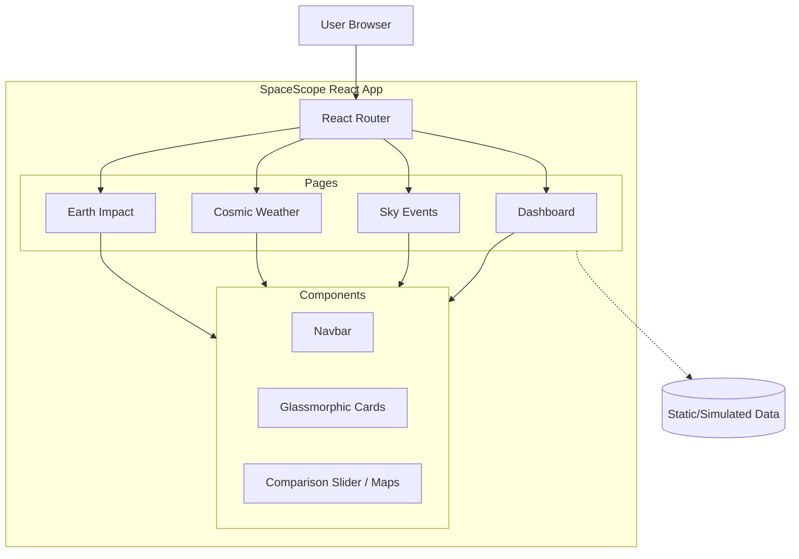
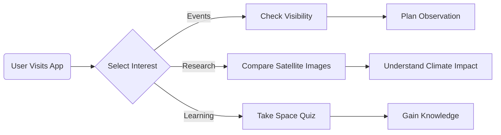

# Project SpaceScope - Presentation Content

## Slide 1: Team Name and Members
**Team Name**: [Insert Team Name]
**Members**:
*   [Member 1 Name]
*   [Member 2 Name]
*   [Member 3 Name]
*   [Member 4 Name]

---

## Slide 2: Problem Definition

**Problem Statement**
*   Space information is fragmented across disconnected platforms (weather sites, mission logs, stargazing apps).
*   Public lacks awareness of how space technology directly benefits Earth (agriculture, disaster relief).

**Existing Problems**
*   **Data Silos**: Real-time solar data and celestial events are hard to correlate.
*   **Poor Accessibility**: Scientific data is often raw and not visualized for general users.
*   **Missed Events**: People miss rare sky events (eclipses, meteor showers) due to lack of centralized alerts.
*   **Engagement Gap**: Educational content is often static and unengaging for students.

---

## Slide 3: Proposed Solution

**SpaceScope Platform**
An interactive, centralized web dashboard that unifies real-time space data, visualization, and education.

**Key Features**
*   **Unified Dashboard**: Central hub for all space-related metrics and timelines.
*   **Visual Sky Map**: Real-time visibility maps for celestial events (e.g., Night Earth visualization).
*   **Cosmic Weather Station**: Live monitoring of solar wind, geomagnetic storms, and aurora forecasts.
*   **Interactive Timelines**: visual history and future of space missions.
*   **Earth Impact Visualization**: "Before/After" satellite data demonstrating real-world applications (e.g., deforestation monitoring).

---

## Slide 4: Technical Approach

**Tech Stack**
*   **Frontend**: React.js (Component-based UI), Vite (Build Tool)
*   **Styling**: Vanilla CSS (Glassmorphism design system), Lucide React (Icons)
*   **Animations**: Framer Motion (Smooth transitions, interactive elements)
*   **Routing**: React Router DOM (SPA navigation)

**Architectural Diagram**

---

## Slide 5: Business Model

**Customer Segments**
*   **Education**: Schools, Universities, STEM programs.
*   **Enthusiasts**: Amateur astronomers, space geeks.
*   **General Public**: People interested in major events (eclipses).

**Value Proposition**
*   **Convenience**: "All-in-one" space situational awareness.
*   **Experience**: Premium, high-fidelity visual experience compared to dry text sites.
*   **Education**: Simplifying complex scientific concepts through interactivity.

**Revenue Streams**
*   **Freemium Model**: Basic access free, Pro features (high-res satellite data, custom alerts) paid.
*   **Educational Licensing**: Bulk licenses for school districts.
*   **Affiliate Integration**: Telescopes or space-tourism partnerships.

**Cost Structure**
*   **Development**: Frontend engineering, UX/UI design.
*   **Hosting**: Cloud infrastructure (Vercel/Netlify).
*   **Data APIs**: Costs for premium real-time satellite/weather API keys (future integration).

---

## Slide 6: Use Cases & Impact

**Target User: The STEM Student**
*   **Goal**: Researching for a project on Climate Change.
*   **Usage**: Uses the **Earth Impact** section to generate "Before/After" visuals of Amazon Reforestation.
*   **Impact**: Better understanding of satellite utility; high-quality visual data for reports.

**Target User: The Amateur Astronomer**
*   **Goal**: Wants to see the Perseid Meteor Shower.
*   **Usage**: Checks **Sky Events** map to confirm visibility in their region vs. cloud cover.
*   **Impact**: Successfully observes the event; increased engagement with the hobby.

**User Flow Diagram**

